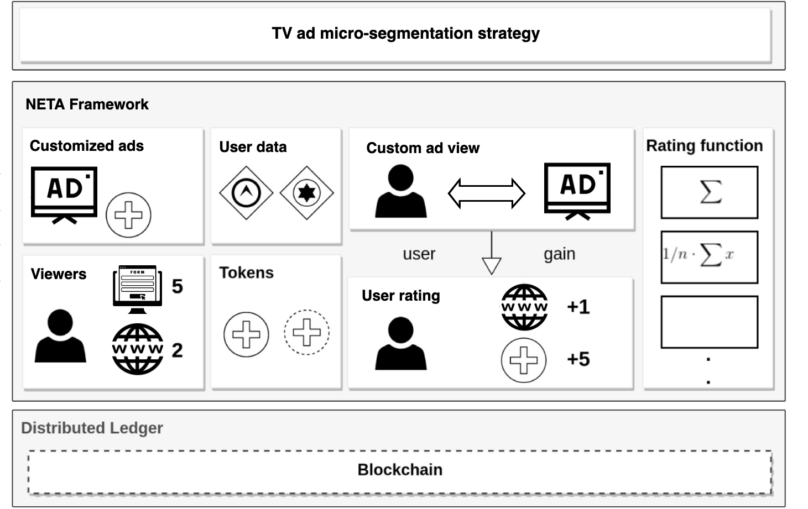
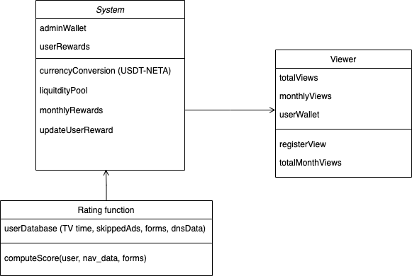
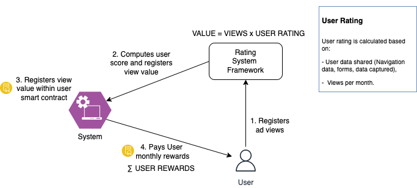

# NETA - Smart contracts for creating customized advertisements on Movistar plus TV

## Goal

The goal of NETA is to generate a micro-segmentation advertisement strategy for Movistar Plus TV, like advertisement works on the Internet.

## Nomenclature

- **Viewer**: a user of Movistar plus platform;
- **Publisher**: an entity that will pay telefonica to broadcast its adversiments to the target audience
- **Views**: a keywork identifying the number of watched ads for the viewer.
- **Customize ads**: Personalized ads to be broadcasted to the matched audience
- **RatingFunction** rating to score the quantity of information that the user provides to Telefonica. Higher values mean that the user will have more personalized ads, and thus, a higher quantity of NETA tokens.Examples:
    - Time spent on specific TV channels (sports, films, music,etc..)
    - Navigation data (DNS based).
    - Score to check if the user has skipped ads.
    - Forms filled by the user with persona information.
    - A weighted combination of the above. 

## Overview

## Features

- Basic access control mechanism to store user views;
- Store the ratings of an Item;
- Provide RatingFunctions to reward user for watching ads;
- Issue NETA compliant tokens to users as reward.

## Class diagram

**Note:** In the diagram the contract Item has two grantPermission functions. However, due to issues from Truffle with function overloading ([ref](https://github.com/trufflesuite/truffle/issues/737)) in the code the Item contract the function *grantPermision(to, amount)* is called *commitPermission(to, amount)*.

## Installation and usage

### Requirements 

WIP

### Installation

WIP

### Future works

- Generate a more sophisticated price rewards for users
- Explore privacy and security issues;

## Authors
Unai Gil Zubeldia
Daniel Garcia Sanchez
Juan Carlos Diaz Torres
David Martin Lambas
Alejandro Molina Sanchez
Carlos Arenas Escribano
